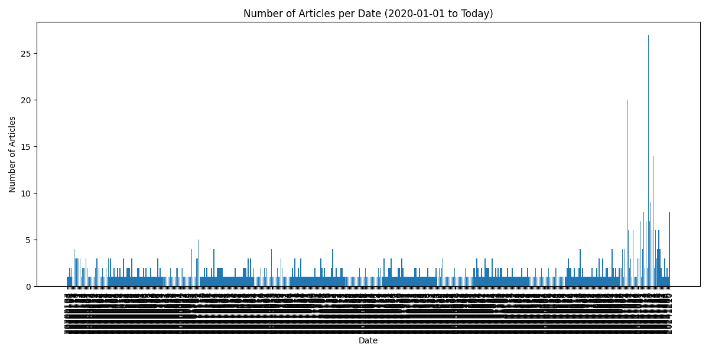
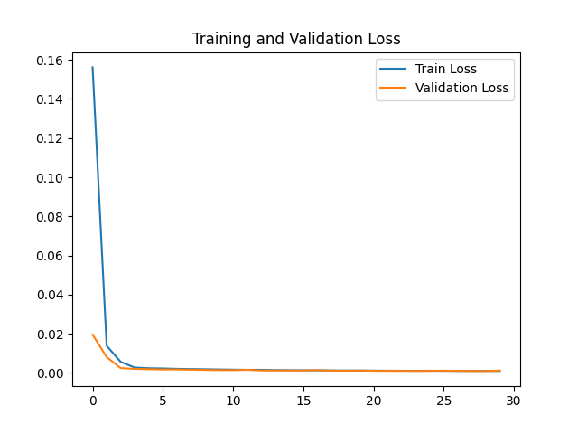
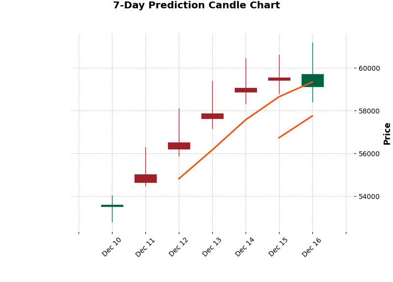
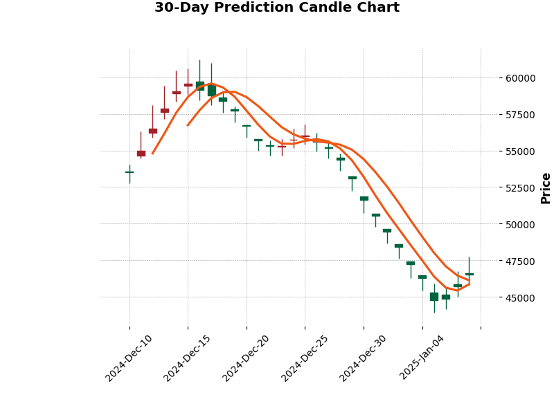
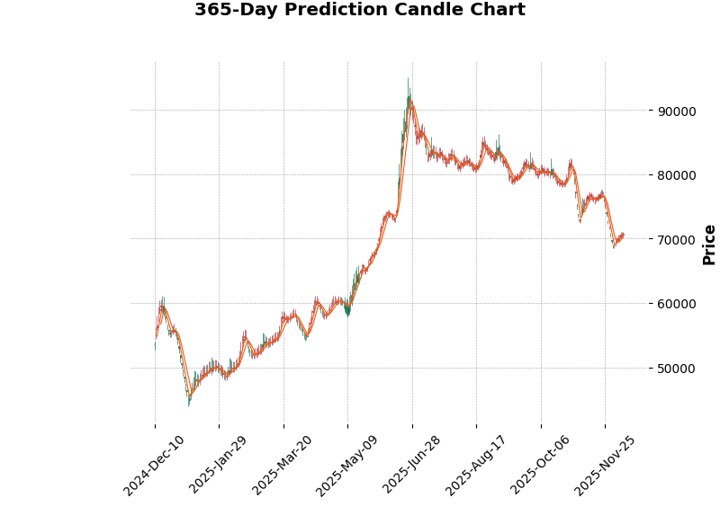

# J-DRAGON
## stock prediction model for samsung electronics

### 1. How to use?
1. Requirement 1: Naver News API

To obtain the API, follow this guide: [click](https://yenpa.tistory.com/2#google_vignette)

Naver News API Documentation: [click](https://developers.naver.com/docs/serviceapi/search/news/news.md)

Insert the received `Client ID` and `Client Secret` into `news_pipeline.py` in scripts folder.

2. Requirement 2: Libraries

You need to install the following Python libraries:

`numpy`, `pandas`, `matplotlib`, `mplfinance`, `scikit-learn`, `torch`, `FinanceDataReader`

Run the following command in your console to install them:

pip install numpy pandas matplotlib mplfinance scikit-learn torch FinanceDataReader

3. Simply execute run.py. That's all you need to do!

### 2. Motivation
In mid-November, when this project was conceptualized, the trend of Samsung Electronics' stock price was not looking good.

Moreover, my own stock account was "all blue." Around the same time, I was learning about ML and DL in the OSS course.

These two ideas came together, and I decided to create a stock prediction program for Samsung Electronics: **J-DRAGON**.

### 3. Explanation
This program predicts Samsung Electronics' stock prices using an LSTM model implemented with PyTorch.

It uses data such as Samsung Electronics' stock information (open, high, low, close prices, and volume), the KRW/USD exchange rate, and news informations about Samsung Electronics.

News data is collected through the Naver News API. However, the API has a limitation as it cannot retrieve articles from the distant past.

Therefore, the program collects data from January 1, 2020 up to the date you run the program.

That said, the reliability of the news data is relatively low, as shown below. As a result, the news data is given a lower weight in the model.

The method for processing news data is simple: If the number of news articles is greater than the previous day, it is assigned a value of 1; otherwise, it is assigned 0.

The rationale is that a higher volume of news about Samsung Electronics reflects greater public interest.

**Data Preprocessing**

Historical stock data for Samsung Electronics and USD/KRW exchange rates are collected using FinanceDataReader from January 1, 2020, to the current date. These datasets are merged based on their Date column to create a combined dataset.

All features are normalized to a scale of 0 to 1 using MinMaxScaler. The features include Stock prices(Open, High, Low, Close), Trading Volume, USD/KRW exchange rate, News sentiment (title_interest).

Single missing values are replaced with the average of their immediate neighbors. Consecutive missing values are filled using the average of the values before and after the missing sequence. After merging stock and exchange rate data, rolling averages (11-day window) are applied to fill any additional missing values.

A lookback window is applied to create sequences of past data for training the LSTM model. For example, if the lookback window is 30, each sequence contains the previous 30 days of data.

The preprocessed dataset is saved as processed_data.csv in the data/ directory.

**training**

The LSTM model is trained using Mean Squared Error (MSE) loss. This loss function minimizes the squared difference between the predicted and actual stock prices, making it suitable for regression tasks.

The training process uses the Adam optimizer, which adapts the learning rate dynamically for faster convergence and better optimization.

During training, the model's performance is evaluated on a separate validation set to monitor overfitting and generalization.

The training loss curve is visualized as follows:

I determined that 30 epochs is an appropriate value. However, you can adjust it according to your preferences.

After training, the model is saved as a PyTorch .pth file for future use or inference.

**prediction**

The trained model generates predictions for user-defined horizons (7, 30, or 365 days).

Predicted values are visualized using candlestick charts.

### 4. Results
The 7-day prediction is as follows:

The 30-day prediction is as follows:

The 365-day prediction is as follows:

Time elapsed: 385.3863527774811 seconds

Fetching Naver News data takes a long time, which increases the overall execution time. It takes 6~7 minutes for my environment.

My environment

LAPTOP: ACER SWIFT GO 14 (2023)

CPU: AMD Ryzen™ 7 7840U

GRAPHICS: Radeon 780M (Internal Grpahics)

RAM: 16G (LPDDR5)

### 5. Conclusion
There are two famous principles on how to avoid losing money in stocks. They are as follows:
1. **Never invest in the domestic(korean-KOSPI and KOSDAQ) stock market.**
2. **Always follow the first principle.**

The 1-year forecast predicts a significant increase in stock prices. Could better days be on the horizon if we endure this year?

The most important takeaway is that investment decisions and responsibilities cannot be delegated to artificial intelligence.

**Investment decisions are entirely the responsibility of the investor, and neither I nor PyTorch can be held accountable for any losses incurred.**

### 6. License
This project is distributed under the MIT License.

### 7. References
1. [네이버 블로그 - [딥러닝] LSTM으로 주가 예측하기 (feat. 삼성전자)](https://m.blog.naver.com/snowstormaw/222837950137)
2. [티스토리 - [네이버 개발자센터 API] 뉴스 검색어의 날짜별 건수 가져오기(파이썬)](https://yenpa.tistory.com/6)
3. [Google Stock Prediction](https://www.kaggle.com/datasets/shreenidhihipparagi/google-stock-prediction)
4. [Pytorch LSTM document](https://pytorch.org/docs/stable/generated/torch.nn.LSTM.html)

### **Lastly....**
..

..

..

..

형 해줄거지?
